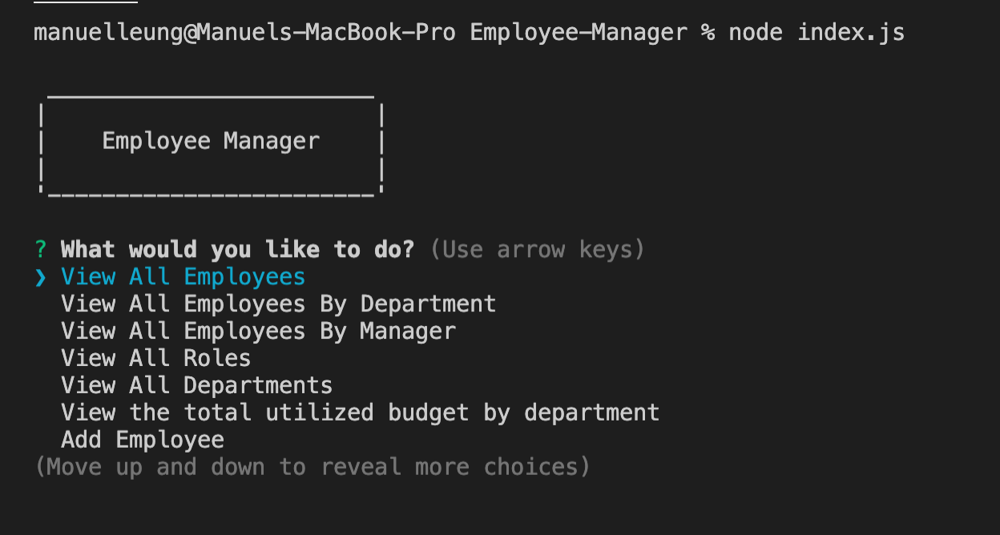

# Employee-Manager


## Description  
This application track down and manage employees, roles and departments. It is controlled with input from the command line and can perform SQL CRUD operations. Input prompts are created using the npm module [Inquirer](https://www.npmjs.com/package/inquirer). 

### Sample Images



    
## Table of Contents

* [User Story](#User-Story)
* [Installation](#installation)
* [Usage](#usage)
* [Credits](#credits)
* [License](#license)
* [Contributing](#contributing)
* [Questions](#questions)

## User Story
```
As a business owner
I want to be able to view and manage the departments, roles, and employees in my company
So that I can organize and plan my business
```

## Installation
1. Clone the repo.
2. Navigate to the project directory.
3. Run command ```npm install``` to install any dependencies.
4. Copy and Paste the content from schema.sql
5. Run schema.sql commands to create the database.
6. Copy and Paste the content from seed.sql
7. Run seed.sql commands to input some initial data on database.

## Usage    
* Navigate to the project directory.
* Enter command ```node index.js``` to run the script.
* Select an action to perform.
* Answer questions for each action.

For more details, please follow the [Demo Video](https://drive.google.com/file/d/1cFR7HygA_etiIlScSgIaHvgfX_vbVSMD/view?usp=sharing)

## Credits  
Developed by: 
Manuel Leung Chen [GitHub](https://github.com/manuelleungchen)

Tools used: 
[npm module Inquirer](https://www.npmjs.com/package/inquirer)

## License
Copyright (c) 2020 - Manuel Leung Chen

Licensed under the [MIT License](https://choosealicense.com/licenses/mit/).

## Questions
Manuel Leung Chen - [GitHub](https://github.com/manuelleungchen )

If you have any question about this application, please reach out me by [Email](manuel.leungchen@gmail.com)


